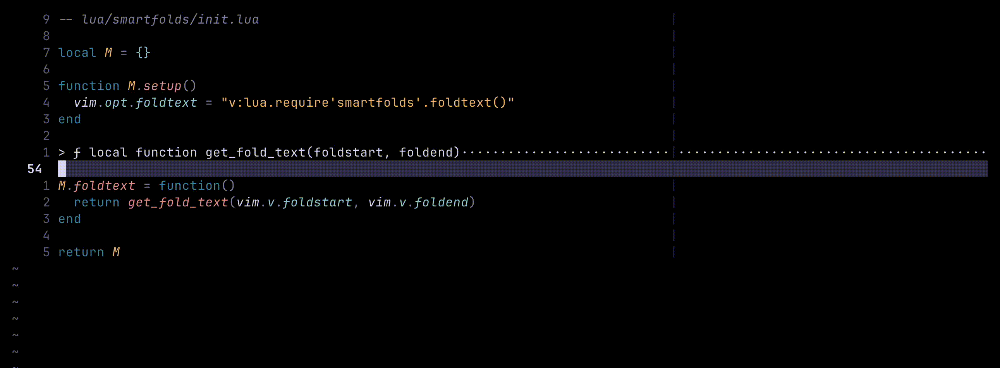

# smartfolds.nvim

> Building smarter folds for Neovim — work in progress! 🛠️✨

---

**smartfolds.nvim** is an experimental Neovim plugin I'm building to rethink how folds are displayed —  
giving you smarter, cleaner, and more meaningful fold previews across **all languages**.

I'm starting with JavaScript and TypeScript for early support, but the ultimate goal is **language-agnostic**, customizable folding for everyone.

I'm building this project *publicly*, sharing all my progress, learnings, and challenges.

Follow the journey here — contributions, feedback, and encouragement are all welcome!

---

## ✨ Features (Planned and In Progress)

- ✅ Smarter folded text: display useful information (like function signatures) instead of `{...}`
- ✅ Treesitter powered parsing (for accurate, reliable code understanding)
- 🚧 Auto-fold imports automatically (like JetBrains IDEs) — *planned!*
- 🚧 Fold Icons in Sign Column (▸/▾ indicators for open/closed folds) — *planned!*
- 🚧 Customizable fold icons, fill characters, and styles — *planned!*
- ✅ Lightweight and minimal performance impact
- ✅ Fully built in Lua, modern and fast

---

## 🎥 Demo

> Here's a quick look at Smartfolds.nvim in action!

_(Note: Early prototype! Lots of improvements on the way 🚀)_

---

## 📖 Goal

- Improve folded text to show **meaningful context** instead of generic `{...}`
- Build smart, beautiful folding **for all languages**
- Make folds useful — not just save space

---

## 🛠 Current Status

- [x] Repository created
- [x] Basic plugin structure in Lua
- [x] First working version of custom `foldtext`
- [x] Basic function signature extraction (using Treesitter)
- [ ] Smarter handling of multi-line signatures
- [ ] Auto-fold imports (planned)
- [ ] Configurable language-specific folding
- [ ] Settings and customization support
- [ ] Polish, optimize, and extend to more languages

_(Note: This is an initial roadmap, might change over time.)_

---

## 🛤️ Building in Public

I'm documenting every step of this project:

- 📝 [Devlog updates](https://devlog.seifhassan.dev)
- 🐦 [Follow on X.com](https://x.com/theseifhassan) for daily/weekly progress

Expect lots of messy commits, experiments, and learning-by-doing!

---

## 🚧 Warning

This plugin is **not production-ready** yet!  
If you install it today, it will be mostly experimental and rough around the edges.

---

## 📬 How to Follow Along

- ⭐ Watch/star this repo to get updates
- 🐦 Follow me on [X.com](https://x.com/theseifhassan)
- 📋 Check the Issues/PRs for milestones and experiments

---

## 📜 License

[MIT License](LICENSE)

---

# ✨

Thanks for checking out smartfolds.nvim —  
I'm excited to build this, explore Neovim and Lua, and share everything along the way!

